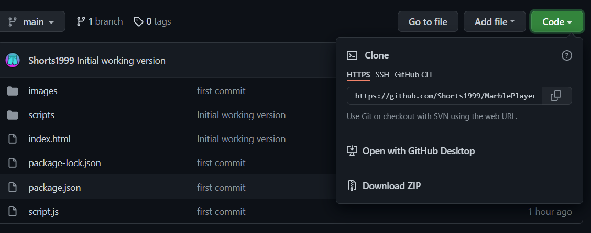
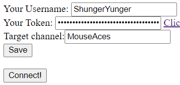

# ShungerYunger's MarbleBot
A simple webpage to automatically join games of "Marbles on stream" designed for the "Joggers vs Shorts" game on [MouseAces' Twitch channel](http://www.twitch.tv/MouseAces)

**IN VERY EARLY BETA**

# How to use
Click the green button on the top right and select "Download ZIP"
  
Extract the zip and open "marble.html"

On the page, there are 3 input boxes, fill these with your Username, an Oauth token (see the howto.html for instructions on how to get a token) 
and the target channel that you want to connect to:
  

Click "Save" to store the credentials, and click "Connect!" to start playing!